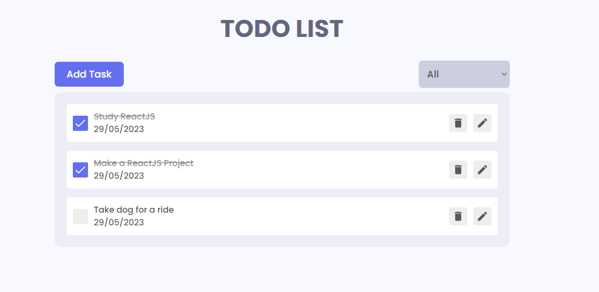
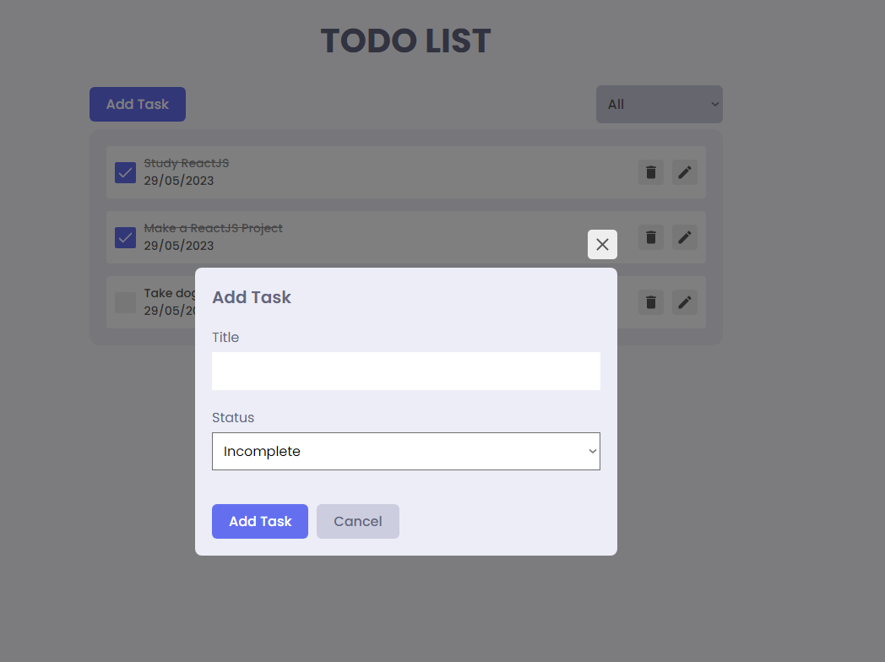

<h1 align="center">TODO LIST</h1>

Project [Live Demo](https://todo-list-app-react-redux.vercel.app/)

<p align="center">This todo list was made with currently most used technologies in the market like: </p>

- **ReactJS**
  - For the interface and functionality of the entire project.
- **Redux**
  - To store data and make the CRUD operations, along with localstorage to store session data.
- **SASS**
  - For the stylization of the project.



<p align="center">You can add a new task and get the exactly date you add it, you can also edit and delete the task and the check boxes can also mark the task as complete or incomplete.</p>


<p align="center">Here's the main modal to add/update tasks.</p>

### How to run the project

```
git clone https://github.com/vitoorsouzaa1/todo-list-react-redux.git

then you run:
  yarn install

after the installation of the packages you can just run:
  yarn start
```

##### <center> Vitor Souza - 2023
